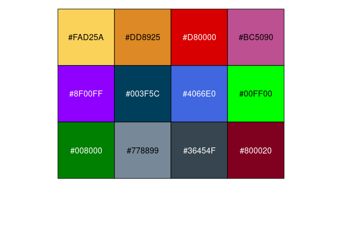
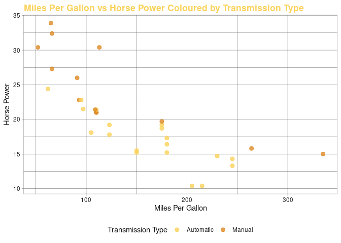
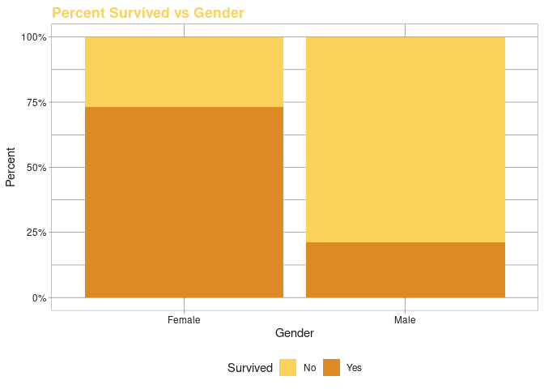

<!-- README.md is generated from README.Rmd. Please edit that file -->

# msand

<!-- badges: start -->
<!-- badges: end -->

The goal of msand is to make reproducing personalized reports and
visualizations easy.

## Installation

You can install the development version of msand from
[GitHub](https://github.com/) with:

``` r
# install.packages("devtools")
devtools::install_github("MichaelSandilands/msand")
```

## Function Summary

The msand functions:

-   `theme_msand()`: A custom theme for visualizations.
-   `palette_msand()`: A personal colour palette for categorical
    visualizations.
-   `scale_colour_msand()` & `scale_color_msand()`: For use when colour
    is specified as an aes() in a ggplot.
-   `scale_fill_msand()`: For use when fill is specified as an aes() in
    a ggplot.

``` r
library(msand)
```

## The Custom Colour Palette I use, `palette_msand()`.

``` r
scales::show_col(palette_msand())
```



## The use of `theme_msand()` and `scale_colour_msand()` Example.

``` r
library(tidyverse)
#> ── Attaching packages ─────────────────────────────────────── tidyverse 1.3.1 ──
#> ✔ ggplot2 3.3.6     ✔ purrr   0.3.4
#> ✔ tibble  3.1.7     ✔ dplyr   1.0.9
#> ✔ tidyr   1.2.0     ✔ stringr 1.4.0
#> ✔ readr   2.1.2     ✔ forcats 0.5.1
#> ── Conflicts ────────────────────────────────────────── tidyverse_conflicts() ──
#> ✖ dplyr::filter() masks stats::filter()
#> ✖ dplyr::lag()    masks stats::lag()

mtcars %>%
    mutate(am = ifelse(am == 0, "Automatic", "Manual")) %>% 
    ggplot(aes(hp, mpg, colour = am)) +
    geom_point(size = 2.5, alpha = 0.8) +
    scale_colour_msand() +
    theme_msand() +
    labs(title = "Miles Per Gallon vs Horse Power Coloured by Transmission Type",
         x = "Miles Per Gallon",
         y = "Horse Power",
         colour = "Transmission Type")
```



## The use of `theme_msand()` and `scale_fill_msand()` Example.

``` r
Titanic %>% 
    as_tibble() %>% 
    uncount(n) %>% 
    ggplot(aes(Sex, fill = Survived)) +
    geom_bar(position = "fill") +
    scale_fill_msand() +
    scale_y_continuous(labels = scales::percent_format()) +
    theme_msand() +
    labs(title = "Percent Survived vs Gender",
         x = "Gender",
         y = "Percent")
```


